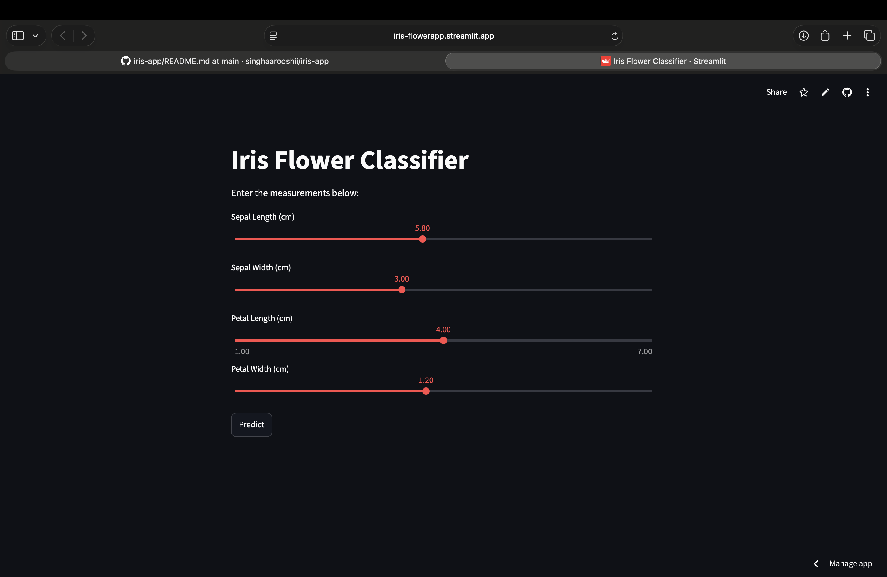
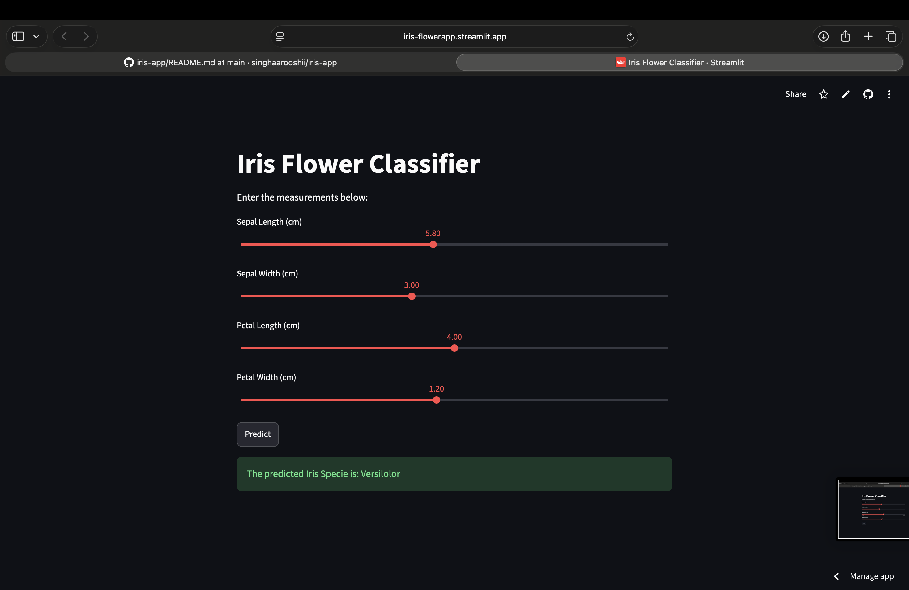
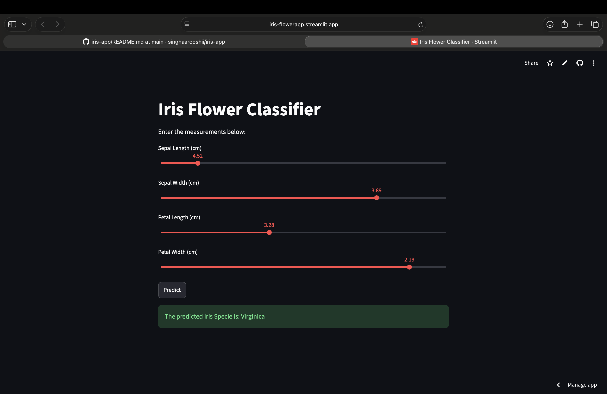
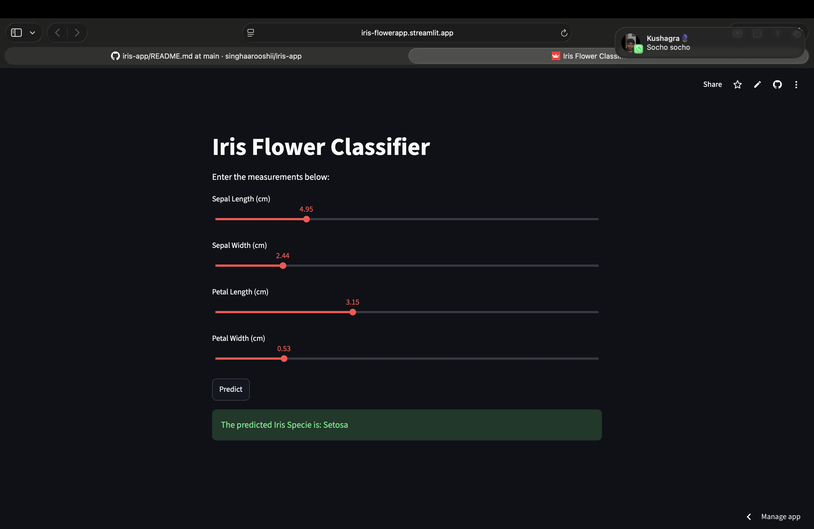

# Iris Flower Classifier

## Overview
The Iris Flower Classifier is a Machine Learning web application that predicts the species of an Iris flower based on four input features: sepal length, sepal width, petal length, and petal width. The application is built using Python, Scikit-learn, and Streamlit.

## Features
- Predicts Iris flower species instantly
- Simple and interactive web interface
- Real-time predictions
- Fast and easy to use

## Dataset
This project uses the Iris dataset, which contains 150 flower samples from three species:
- Iris Setosa
- Iris Versicolor
- Iris Virginica

## Technologies Used
- Python
- Streamlit
- Scikit-learn
- Pandas
- NumPy

## Project Structure
```
iris-flower-classifier/
│── app.py
│── model.pkl
│── iris.csv
│── requirements.txt
│── README.md
```


## How to Use
1. Enter the flower measurements.
2. Click the **Predict** button.
3. View the predicted Iris flower species.

## Future Enhancements
- Display prediction confidence
- Add flower images
- Improve the user interface
- Support multiple machine learning models

  #  Iris Flower Classifier

## Overview
The Iris Flower Classifier is a Machine Learning web application that predicts the species of an Iris flower based on four input features: sepal length, sepal width, petal length, and petal width. The application is built using Python, Scikit-learn, and Streamlit.

## Features
- Predicts Iris flower species instantly
- Simple and interactive web interface
- Real-time predictions
- Fast and easy to use

## Dataset
This project uses the Iris dataset, which contains 150 flower samples from three species:
- Iris Setosa
- Iris Versicolor
- Iris Virginica

## Technologies Used
- Python
- Streamlit
- Scikit-learn
- Pandas
- NumPy

## Project Structure
```
iris-flower-classifier/
│── app.py
│── model.pkl
│── iris.csv
│── requirements.txt
│── README.md
```


## How to Use
1. Enter the flower measurements.
2. Click the **Predict** button.
3. View the predicted Iris flower species.

## Future Enhancements
- Display prediction confidence
- Add flower images
- Improve the user interface
- Support multiple machine learning models

## 📸 Screenshots

### Home Page


### Sample Prediction 1


### Sample Prediction 2


### Sample Prediction 3



## Author

**Name:** Arushi Singh  
**Branch:** B.Tech-Computer Science & Engineering  
**College:** Institute of Technology and Management, Gorakhpur, Uttar Pradesh

